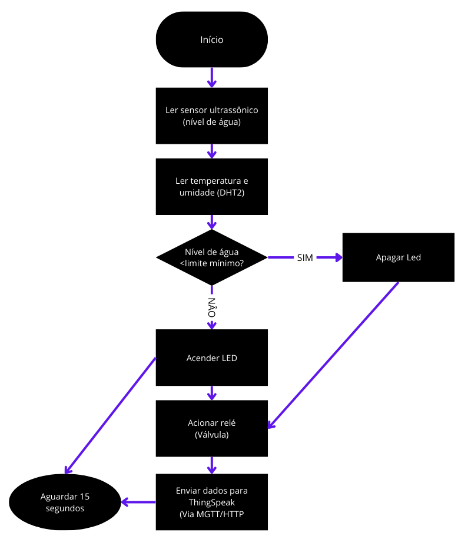

# 🌊 Projeto de Monitoramento de Nível de Água com ESP32 e IoT
Implementação e Aplicabilidade da Internet das Coisas (IoT) na Gestão da Água e Saneamento

Este projeto foi desenvolvido como parte da atividade final da disciplina **OBJETOS INTELIGENTES CONECTADOS** no curso de Análise e Desenvolvimento de Sistemas.

A proposta é criar um sistema embarcado usando **ESP32**, sensores e atuadores, capaz de enviar dados de forma remota via **MQTT** e visualizar as informações no **ThingSpeak**.

---

## 📌 Objetivos

- Monitorar o nível da água em um reservatório usando sensor ultrassônico.
- Coletar temperatura e umidade com o sensor DHT22.
- Acionar um LED e relé em condições críticas.
- Enviar os dados para a nuvem via MQTT (ThingSpeak).
- Simular o sistema com Wokwi e testar em ambiente físico.

---

## ⚙️ Componentes e Tecnologias

| Componente         | Função                                   |
|--------------------|-------------------------------------------|
| ESP32              | Microcontrolador principal               |
| Sensor HC-SR04     | Medição de nível de água                 |
| Sensor DHT22       | Temperatura e umidade                    |
| Módulo Relé        | Acionamento de válvula                   |
| LED                | Alerta visual                            |
| ThingSpeak         | Visualização dos dados na nuvem          |
| MQTT               | Protocolo de comunicação leve e eficiente|
| Wokwi              | Simulação de circuito                    |

---

## 📊 Visualização dos Dados

Você pode ver o canal ThingSpeak com os dados em tempo real aqui:  
🔗 **[Canal ThingSpeak](https://thingspeak.mathworks.com/channels/2681880)**

---

## 🚀 Como Executar o Projeto

### 👉 Simulação via Wokwi:
1. Acesse o link do projeto no Wokwi: [Acesse a simulação](https://wokwi.com/projects/410766655456274433)
2. Clique em “Start Simulation”.
3. Observe os dados sendo gerados no console e/ou ThingSpeak.

### 👉 Execução Real (com protótipo físico):
1. Conecte o ESP32 com os sensores conforme o diagrama.
2. Faça upload do código no Arduino IDE.
3. Insira suas credenciais Wi-Fi e chave do canal ThingSpeak no código.
4. Abra o monitor serial para acompanhar os dados.

---

## 💻 Simulação no Wokwi

Este projeto foi simulado com sucesso no ambiente virtual Wokwi:  
🔗 **[Acesse a simulação](https://wokwi.com/projects/410766655456274433)**

---

## 🎥 Demonstração em vídeo

Assista à demonstração do projeto em funcionamento no YouTube (vídeo não listado):  
🔗 **[Assista ao vídeo](https://youtu.be/VYlimXNDr7Y?si=XsyUXsbUd0TET6M)**

---

## 🧩 Fluxograma

---

## ⏱️ Medições de Tempo

Tempo médio entre ações dos sensores e atuadores via MQTT:

| Nº da Medição | Sensor/Atuador         | Tempo de Resposta (ms) |
|---------------|-------------------------|--------------------------|
| 1             | Sensor HC-SR04          | 500                      |
| 2             | DHT22                   | 550                      |
| 3             | Acionamento do relé     | 600                      |
| 4             | LED                     | 400                      |

📄 Ver mais em: `Medicoes/tabela_tempos.xlsx`

---

## 📄 Artigo do Projeto

Acesse a documentação acadêmica completa do projeto:  
📄 **[Artigo em PDF](documentacao/artigo-monitoramento-nivel-agua.pdf)**

---

## 📂 Documentação

- 📄 [Relatório Final PDF](Documentacao/A3_Relatorio_Final)
- 📝 [Relatório Word (editável)](Documentacao/Relatorio.docx)

---

## ✅ Status do Projeto

- [x] Pesquisa teórica  
- [x] Desenvolvimento do artigo  
- [x] Protótipo físico/simulação  
- [x] Upload do código  
- [x] Resultados e análise  
- [x] Conclusão final do artigo  

---

## 👥 Integrantes

- Fernando Alvarenga Moreira – [@fmoreira10](https://github.com/fmoreira10)  
- David Santos da Silva  
- Marcos Vinicius Acario Bastos  

---

## 📚 Referências

- [ThingSpeak Documentation](https://thingspeak.com/)
- [ESP32 Documentation](https://docs.espressif.com/projects/esp-idf/en/latest/esp32/)
- [ODS 6 - ONU Brasil](https://brasil.un.org/pt-br/sdgs/6)

---

## 🧠 Licença

Este projeto está sob a licença MIT. Sinta-se livre para utilizar, modificar e distribuir com os devidos créditos.

